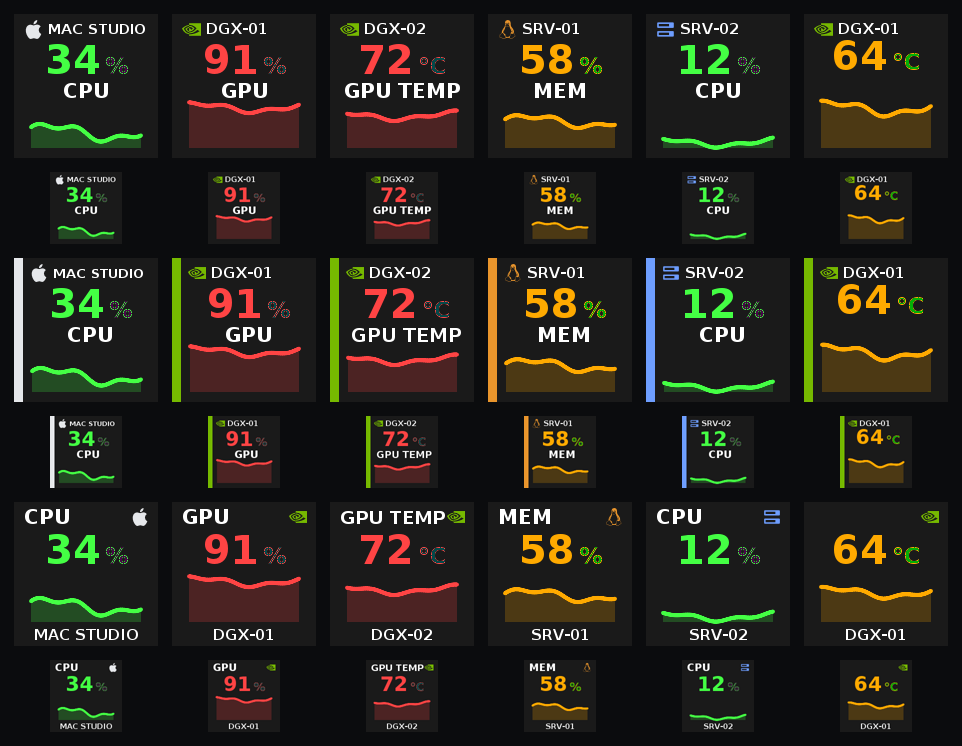

# lhm-streamdeck — macOS and DGX Spark fork

A fork of [moeilijk/lhm-streamdeck](https://github.com/moeilijk/lhm-streamdeck)
that runs the plugin **natively on macOS** and monitors **NVIDIA DGX Spark**
(GB10, aarch64) hosts alongside ordinary Linux servers.

> Upstream's own documentation is preserved at
> [`docs/README.upstream.md`](docs/README.upstream.md) and still applies to
> everything this fork does not change.

## Why this fork exists

**1. macOS support.** LibreHardwareMonitor and HWiNFO are Windows applications,
so their Stream Deck plugins are Windows-only. Upstream's manifest declared
`"OS": [{"Platform": "windows"}]` and shipped `lhm.exe`, so it would not install
on a Mac — even though the Go source already cross-compiled to `darwin/arm64`
untouched, because the Windows-specific code was already isolated behind build
tags for the Linux/OpenDeck build.

The port itself is small. macOS reads sensors from `lhm-companion` over plain
HTTP exactly as Linux does; only Windows needs the .NET `lhm-bridge` subprocess.
The one genuine platform difference is `syscall.SysProcAttr{Pdeathsig:...}`,
which does not exist on darwin, so the child-process handling is split per-OS.

**2. NVIDIA DGX Spark support.** Upstream's `lhm-companion` publishes
`linux_amd64` binaries only. A DGX Spark is aarch64, so this fork builds the
agent for `linux/arm64` too and ships a single self-extracting installer that
carries both architectures.

**3. Monitoring more than one machine at once.** Running tiles against several
hosts surfaced a set of cross-host bugs, fixed here (see below).

## Architecture

```
      Mac (Stream Deck)                       Remote hosts
 ┌──────────────────────────────┐
 │ Elgato Stream Deck           │
 │  └ com.moeilijk.lhm.sdPlugin │
 │     ├ lhm         (universal)│──HTTP──▶ linux-srv-1:8085  lhm-companion (amd64)
 │     └ lhm-companion  ◀─spawn─┤──HTTP──▶ linux-srv-2:8085  lhm-companion (amd64)
 │        (macOS, :8085)        │──HTTP──▶ dgx-spark-1:8085  lhm-companion (arm64)
 └──────────────────────────────┘──HTTP──▶ dgx-spark-2:8085  lhm-companion (arm64)
```

Every host — including the Mac — serves the same Libre Hardware Monitor
`/data.json`, so the plugin treats them all identically as source profiles.
Nothing is bespoke per host.

## What this fork adds

| | |
|---|---|
| **macOS plugin** | Universal (arm64 + x86_64) binary, `mac` added to the manifest |
| **`mac-companion/`** | New macOS metrics daemon serving Libre Hardware Monitor-format `/data.json`. Auto-spawned by the plugin; no separate install, no `sudo` |
| **arm64 agent builds** | `lhm-companion` cross-compiled for aarch64 so DGX Sparks are supported |
| **Self-extracting installer** | One file carrying both Linux architectures, with SELinux, firewalld/ufw and old-systemd handling plus a `--diagnose` mode |
| **Lab tile style** | Optional per-key renderer with a host badge — brand icon, accent rail and host name — so a key says which machine it is watching |
| **`pkg/vecicon`** | Minimal SVG path rasterizer (including elliptical arcs) so icons scale to any size instead of shipping per-size bitmaps |

### Bug fixes that also affect Windows

These are not macOS-specific; they were found while running against several
hosts and apply to upstream on every platform.

- **Property inspectors wiped every source profile.** Stream Deck's
  `setGlobalSettings` *replaces* the stored object rather than merging it. The
  inspectors wrote partial payloads (`{ pollInterval }`, `{ derivedPresets }`),
  so each write dropped `sourceProfiles`; the plugin then saw an empty list,
  synthesised a lone "Default" and persisted it. Changing the poll interval was
  enough to lose every configured host.
- **Switching a tile's source kept the old sensor.** Sensor IDs are namespaced
  per source (`/apple/cpu/0` on a Mac, `/cpu` on Linux), so the carried-over ID
  resolved to nothing — and the failed lookup was reported as *"Libre Hardware
  Monitor Unavailable"* about a host that was answering in under 100 ms.
- **Category filter kept the current sensor selected**, so filtering to GPU or
  Memory still showed the previously chosen CPU readings.
- **Unknown profile IDs resolved to localhost**, because an empty host becomes
  `127.0.0.1` — a tile referencing a deleted profile quietly displayed local
  readings under another machine's name.

## Install on macOS

### Sideloading a built plugin

Stream Deck plugins from outside the Marketplace are sideloaded. Either:

**Double-click.** Open `com.moeilijk.lhm.streamDeckPlugin`; Stream Deck installs
it and prompts about the unknown developer. This fork is not signed or
notarised, so if macOS quarantines the download, clear it first:

```bash
xattr -cr ~/Downloads/com.moeilijk.lhm.streamDeckPlugin
```

**Or copy the folder manually**, which avoids Gatekeeper entirely:

```bash
cp -R com.moeilijk.lhm.sdPlugin \
  ~/Library/Application\ Support/com.elgato.StreamDeck/Plugins/
xattr -cr ~/Library/Application\ Support/com.elgato.StreamDeck/Plugins/com.moeilijk.lhm.sdPlugin
# then restart Stream Deck
```

### Building it yourself

Binaries you compile locally carry no quarantine attribute, so this is the
smoothest route. Requires Go 1.25+ (`brew install go`):

```bash
./scripts/macos/build-plugin.sh     # universal plugin + bundled mac companion
./scripts/macos/install-plugin.sh   # install and restart Stream Deck
./scripts/macos/package-plugin.sh   # optional: .streamDeckPlugin for sharing
```

The plugin auto-spawns the bundled companion on `127.0.0.1:8085` for local Mac
metrics.

## Install on Linux servers and DGX Sparks

```bash
./scripts/macos/build-agents.sh          # linux amd64 + arm64
./scripts/macos/make-agent-installer.sh  # -> build/agents/install-lhm-companion.sh
```

Copy that one file to each host — `scp`, USB, whatever works — and run it there.
It needs no network access:

```bash
sudo sh install-lhm-companion.sh                 # install and start on :8085
sudo sh install-lhm-companion.sh --open-firewall # also open the port
sudo sh install-lhm-companion.sh --diagnose      # report state, change nothing
sudo sh install-lhm-companion.sh --uninstall
```

If you can SSH to the hosts from your Mac, `scripts/macos/deploy-agent.sh
user@host` does the copy, install and verification in one step instead.

It detects `x86_64` vs `aarch64`, smoke-tests the binary, writes a systemd unit,
and verifies the port is actually listening before exiting. On failure it prints
arch, OS, systemd version, SELinux mode and binary label, listening state,
firewall and recent journal lines.

It handles three things that commonly break this on RHEL-family hosts:

- **SELinux** — a binary copied out of `/tmp` keeps a label systemd refuses to
  execute (`status=203/EXEC`); the installer relabels it.
- **Old systemd** — `ProtectSystem=strict` needs systemd 232; RHEL/CentOS 7
  ships 219 and rejects the unit, so it falls back to `full`.
- **firewalld / ufw** — detected and reported with the exact command, or opened
  with `--open-firewall`.

## Configuring the deck

Add a **Libre Hardware Monitor → Settings** key first and create one source
profile per host (`host` + port `8085`), giving each an icon and accent colour.
Every key pointing at that host inherits them. Then each sensor key picks a
profile, a sensor and a reading.

To watch LLM rates from [sparkDash](https://github.com/MiaAI-Lab/sparkDash),
add another source with **Kind** set to SparkDash. Point **host** and **port**
at the dashboard (default **5555** for SparkDash’s own HTTP listener, **443**
if you reach it over HTTPS). Pick a **unit**, Save, then bind tiles as usual.
Live decode/prefill tok/s, KV cache and queue readings show up as an **LLM**
category. Lab-style tiles for token rates use `tok/s` / `prefill/s` as the
middle label and omit the unit next to the number.

Per key, **Tile style** chooses between upstream's classic histogram and the
**Lab** style shown below. **Middle label** overrides the label under the value,
and hiding it gives that space back to the graph.



Value colour follows a green/amber/red ramp against the key's configured range,
so set **Min/Max** sensibly — a GPU at 72 °C reads red against 0–100 but green
against 30–90.

## Known limitations

- **No Mac CPU/GPU temperature.** Apple Silicon die temperatures come from the
  SMC, which recent macOS no longer exposes to unprivileged processes
  (`powermetrics: unrecognized sampler: smc`). The companion omits the
  Temperatures section rather than reporting fabricated values. Linux and DGX
  hosts report temperatures normally.
- **DGX Spark GPU fields.** Verified against two GB10 units: GPU temperature,
  load, memory load, power draw and core clock all read normally. Only
  `fan.speed` is absent — GB10 has no discrete fan to report — so no Fans
  section appears. Note the Spark's unified memory means "GPU memory" is not a
  separate pool from system RAM.
- **`lhm-companion` has no authentication** and binds `0.0.0.0`. Fine on a
  trusted VLAN; firewall it or put it behind a VPN otherwise.
- Binaries here are unsigned and unnotarised.

## Credit and licence

All of the hard work is [moeilijk](https://github.com/moeilijk)'s — this fork
adds macOS and aarch64 support on top of it. `lhm-streamdeck` and
`lhm-companion` are GPL-3.0 and this fork inherits that licence.

The Apple, NVIDIA and Linux marks used as host badges come from
[simple-icons](https://github.com/simple-icons/simple-icons) (CC0-1.0). They
remain trademarks of their respective owners and are used only to label which
machine a key is monitoring. This project is not affiliated with or endorsed by
Elgato, Apple, NVIDIA or moeilijk.
